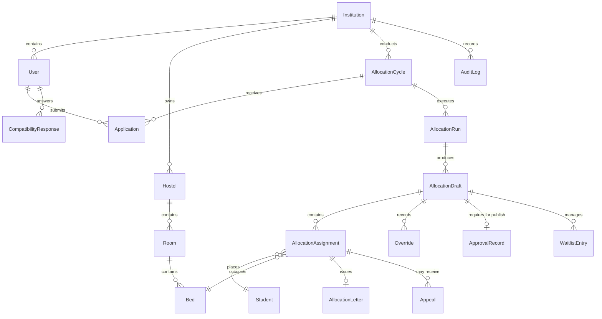

# HostelHub Domain Data Model & Entity Relationship Diagram (ERD)

This document specifies the MongoDB document schema, relational semantics, and database-level constraints that guarantee data integrity, tenant isolation, and zero double-assignment.

---

## 1. Entity Relationship Diagram (ERD)



---

## 2. Core Entities & Schema Definitions

### 1. `Bed` (`beds`)

Represents an individual residential bed unit.

```typescript
interface BedDocument {
  _id: ObjectId;
  institution_id: ObjectId;
  hostel_id: ObjectId;
  room_id: ObjectId;
  bed_no: string; // e.g. "A", "B"
  status: "free" | "assigned" | "held" | "maintenance";
  accessible: boolean; // Wheelchair / ground-floor accessibility
  current_student_id?: ObjectId;
  version: number; // Optimistic concurrency counter
}
```

### 2. `AllocationDraft` (`allocation_drafts`)

Staging entity for allocation results under warden review before provisional publication.

```typescript
interface AllocationDraftDocument {
  _id: ObjectId;
  institution_id: ObjectId;
  cycle_id: ObjectId;
  run_id: ObjectId;
  version_number: number; // Incremented on every override (If-Match)
  status: "UNDER_REVIEW" | "READY_FOR_APPROVAL" | "CHANGES_REQUESTED" | "APPROVED" | "PUBLISHED";
  approval_id?: string; // Mandatory foreign key to ApprovalRecord
  published_at?: Date;
  created_at: Date;
  updated_at: Date;
}
```

### 3. `AllocationAssignment` (`allocation_assignments`)

Represents the placement of a student into a specific bed within a draft.

```typescript
interface AllocationAssignmentDocument {
  _id: ObjectId;
  institution_id: ObjectId;
  draft_id: ObjectId;
  student_id: ObjectId;
  bed_id: ObjectId;
  score: number; // Composite MCDA score (0-100)
  score_breakdown: { P: number; C: number; F: number; D: number; K: number };
  is_overridden: boolean;
  status: "active" | "vacated" | "swapped";
}
```

### 4. `ApprovalRecord` (`approval_records`)

Maker-Checker formal sign-off required prior to publishing.

```typescript
interface ApprovalRecordDocument {
  _id: ObjectId;
  institution_id: ObjectId;
  draft_id: ObjectId;
  approver: { id: string; email: string; role: "chief_warden" };
  second_approver?: { id: string; email: string; role: "dean" }; // Required for escalated overrides
  approved_at: Date;
  comment: string;
}
```

---

## 3. Critical Integrity Constraints

### Constraint 1: Prevention of Double-Assignment

A bed must never be assigned to more than one student in the same draft or published state, and a student must never receive more than one bed.

- **Compound Unique Index on Draft Bed Placement:**
  ```javascript
  db.allocation_assignments.createIndex(
    { draft_id: 1, bed_id: 1 },
    { unique: true, partialFilterExpression: { status: "active" } },
  );
  ```
- **Compound Unique Index on Student Placement:**
  ```javascript
  db.allocation_assignments.createIndex(
    { draft_id: 1, student_id: 1 },
    { unique: true, partialFilterExpression: { status: "active" } },
  );
  ```
- **Live Bed Occupancy Check:**
  Moving or assigning a bed requires an atomic conditional update:
  ```javascript
  db.beds.updateOne(
    { _id: targetBedId, status: "free", version: expectedVersion },
    { $set: { status: "assigned", current_student_id: studentId }, $inc: { version: 1 } },
  );
  ```

### Constraint 2: Prevention of Publication Without Approval (Four-Layer Gate)

Publishing an allocation without Maker-Checker approval is barred across four distinct architectural layers:

1. **Database Schema Validation (`AllocationDraftModel`):**
   ```javascript
   AllocationDraftSchema.pre("save", function (next) {
     if (this.status === "PUBLISHED" && !this.approval_id) {
       return next(new Error("Cannot publish draft without a valid approval_id"));
     }
     next();
   });
   ```
2. **Service Guard (`DraftWorkflowService.publishDraft`):**
   Requires an authenticated `ApprovalRecord` ID created by an authorized `chief_warden` before executing the transition.
3. **API Level Guard (`/api/v1/drafts/:id/publish`):**
   Rejects publishing with `422 Unprocessable Entity` or `400 Bad Request` if the draft status is not `APPROVED`.
4. **UI Guard (`review-console.tsx`):**
   The "Publish Allocation" button is disabled and hidden until the Chief Warden approval ceremony is recorded.

### Constraint 3: Optimistic Concurrency Control (`If-Match`)

Concurrent edits to drafts, applications, or beds are protected using version counters:

- Client requests pass the current version in the `If-Match` HTTP header.
- Mutating queries enforce `{ _id: id, version: expectedVersion }`.
- If another user updated the entity in the interim, MongoDB returns 0 modified documents, throwing a `409 Version Conflict` to the client.
