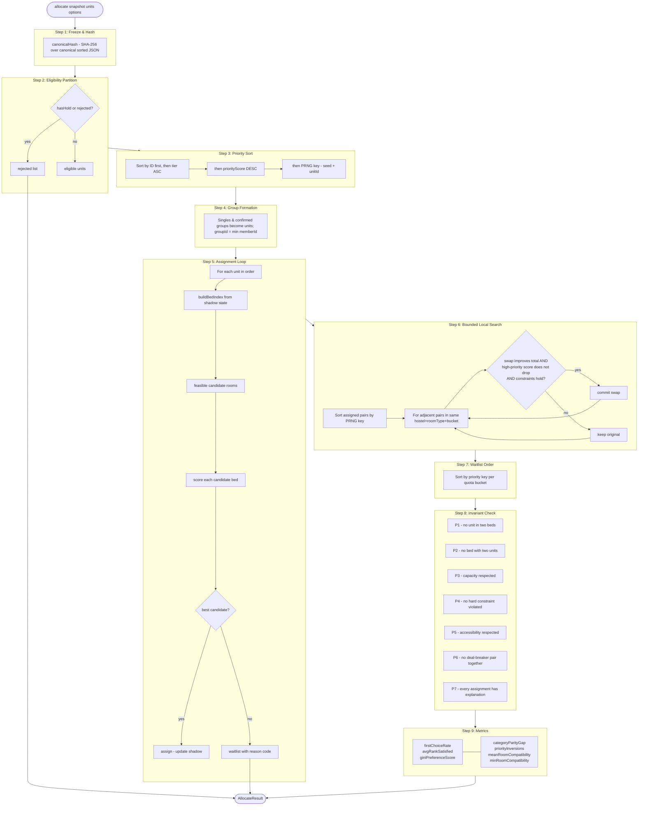

# Allocation Engine — `packages/domain/src/allocation`

Pure TypeScript implementation of the hostel bed allocation pipeline.
No I/O, no `Date.now()`, no `Math.random()` — all randomness comes from a caller-supplied seed.

---

## Pipeline Diagram



---

## Invariants

| Code | Description                                                          | Throws                      |
| ---- | -------------------------------------------------------------------- | --------------------------- |
| P1   | No unit assigned to more than one bed                                | `InvariantError("P1", ...)` |
| P2   | No bed occupied by more than one unit                                | `InvariantError("P2", ...)` |
| P3   | Room occupancy ≤ room capacity                                       | `InvariantError("P3", ...)` |
| P4   | No unit with active hold assigned; gender policy respected           | `InvariantError("P4", ...)` |
| P5   | Units with `accessibilityNeed = true` placed only in accessible beds | `InvariantError("P5", ...)` |
| P6   | No mutual deal-breaker pair placed in the same room                  | `InvariantError("P6", ...)` |
| P7   | Every `Assignment` object has a non-null `explanation`               | `InvariantError("P7", ...)` |

---

## Scoring Formula

```
S(u, r) = wP·P + wC·C + wF·F + wD·D + wK·K

P = preference rank satisfaction: 1 − (rank−1)/N   (0 if hostel not listed)
C = roommate compatibility (0..1), neutral 0.5 for empty rooms
F = fill factor: 0.0 opens new room, 0.5 joins partial, 1.0 completes room
D = proximity: max(0, 1 − walkingMinutes/30)
K = continuity: 1 if priorBlock == room.block, else 0

Default weights: wP=0.45, wC=0.30, wF=0.10, wD=0.10, wK=0.05
Result scaled to integer ×1,000,000 (no floating-point drift across machines)
```

---

## Hard Constraints (HC1–HC11)

| Code | Rule                                                                          |
| ---- | ----------------------------------------------------------------------------- |
| HC1  | One bed per unit (not already assigned)                                       |
| HC2  | One unit per bed (bed not occupied)                                           |
| HC3  | Bed status = available AND room capacity not exceeded                         |
| HC4  | Gender policy: unit.gender matches hostel.genderPolicy or "coed"              |
| HC5  | Quota bucket match; spill-over allowed when own bucket exhausted              |
| HC6  | Accessibility need → accessible bed; reservation window blocks non-need units |
| HC7  | Room programme filter (MTech-only etc.)                                       |
| HC8  | Room fee category requirement                                                 |
| HC9  | Hold active → unit blocked entirely                                           |
| HC10 | Group integrity: all members fit in same room                                 |
| HC11 | Mutual deal-breaker opt-in: questionnaire conflict blocks placement           |

---

## Metrics Glossary

| Metric                  | Description                                                                          |
| ----------------------- | ------------------------------------------------------------------------------------ |
| `firstChoiceRate`       | Fraction of assigned units that received hostel rank 1 (0..1)                        |
| `avgRankSatisfied`      | Mean rank position across assigned units (1 = first choice)                          |
| `giniPreferenceScore`   | Gini coefficient of total scores (0 = perfect equality)                              |
| `categoryParityGap`     | Max difference in firstChoiceRate across quota buckets                               |
| `priorityInversions`    | Count of lower-priority units with better rank than higher-priority ones (must be 0) |
| `meanRoomCompatibility` | Mean room compatibility score (0..1) across assigned rooms                           |
| `minRoomCompatibility`  | Minimum room compatibility score (0..1)                                              |

---

## Determinism Guarantee

Given identical `snapshot`, `units`, and `options.seed`:

1. The canonical hash is identical on every machine (SHA-256 over canonical sorted JSON, no locale-dependent ops).
2. The priority sort is stable: sorted by ID first, then tier + score → same PRNG key → same order.
3. Candidate scoring uses only the snapshot state — no clocks, no random.
4. Local search pair iteration order is seeded.

Changing `seed` only affects tiebreak resolution. The total number of assigned units
and which students end up on the waitlist is seed-independent (unless the scenario
has exact score ties that cross wait/assign boundaries).
